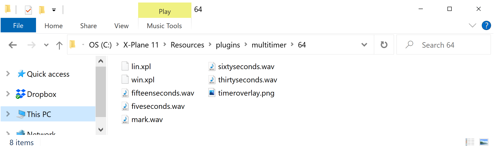
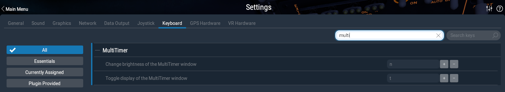
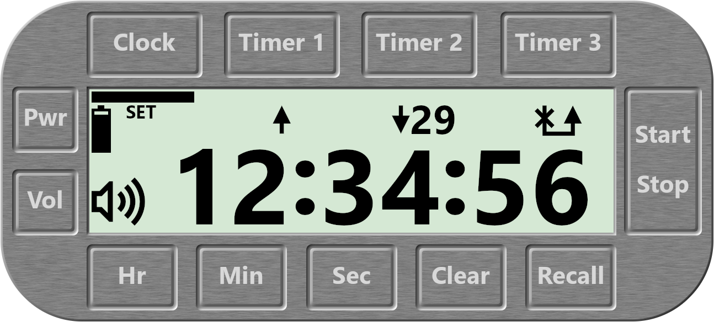

# Introduction

A central part of managing a flight is timekeeping. The pilot must be aware of 
the elapsed time on a navigation leg in order to know when to expect the start 
of the next navigation leg. It is also good practice to conduct FREDA checks at 
a defined interval. The pilot may at times need to know the time spent aloft.

The MultiTimer is a tool designed to meet these needs. In addition to the usual
clock, three independent timers are provided. Each timer can count up or count 
down. Count-down timers provide audio callouts at key moments

# Installation

Copy the "multitimer" folder from the zip file into the X-Plane 11\\Resources\\plugins 
folder. The following screenshot shows the contents of the MultiTimer 
plugin folder.

{width=6.5in}

A keyboard command must be configured to toggle the display of the MultiTimer. 
Open the X-Plane settings menu and click "Keyboard".  Type "multi" in the 
"Search Commands" box. An entry entitled "Toggle display of the MultiTimer window" 
will appear. Click the "+" button and press the key for your preferred
keystroke. Finally, click "Done". In the screenshot below, the "t" key has been 
chosen to toggle the display of the MultiTimer.  
  
{width=6.5in}

# Operating Procedures

## Window Manipulation

A {height=11pt} symbol will appear if the cursor is moved to 
the top-left area of the window (left of the "Clock" button and above the "Pwr" 
button). Click this symbol to close the window. Closing the window will not impact 
the clock or any running timers.

A {height=11pt} symbol will appear if the cursor is moved to 
the thin rectangular area above the "Clock", "Timer 1", "Timer 2", "Timer 3" 
buttons and below the top edge of the MultiTimer. If the mouse is clicked while 
this symbol is displayed, the symbol will replaced with the 
{height=11pt} symbol. Dragging the mouse will move the window 
around the monitor.

A {height=11pt} symbol will appear if the cursor is moved to 
the bottom-right area of the window (right of the "Recall" button and below the 
"Start/Stop" button). If the mouse is clicked while this symbol is displayed, 
the symbol will change to {height=11pt} symbol. 
Dragging the mouse will resize the window.

The key command setup in the Installation section of this document can be used to
toggle the display of the MultiTimer.

## Power On/Off

The MultiTimer will initially be switched off. Click the "Pwr" button to switch 
on the MultiTimer. When the device is switched on, the clock will be set to the 
simulator local time. All timers will be cleared. Switching the MultiTimer off 
/ on is a quick way to clear all three timers.

## Selecting a Chronometer

Click "Clock", "Timer 1", "Timer 2" or "Timer 3" to select the required 
chronometer. Selecting a chronometer will:

* Display the selected chronometer's time on the LCD HH:MM:SS display
* Cause control button clicks to be applied to the selected chronometer

The selected chronometer will be indicated by a  symbol at the top 
of the LCD, below the button for the selected chronometer.

## Setting the Clock

The clock time is automatically set to the simulator local time when the device 
is powered. It might be necessary to change the clock time in flight. The most 
likely scenario for this is when crossing into a different time zone.

Click and hold the "Clock" button for two seconds. The clock will signal that 
it can be changed by displaying "SET" on the LCD. The "Hr", "Min" and "Sec" 
buttons can then be clicked to change the clock time. Clicking "Clock", 
"Timer 1", "Timer 2" or "Timer 3" will exit the clock setting mode.

## Count-Up Timer

Select a timer that has not yet been used or clear a previously used timer. 
Click "Start/Stop". A {height=11pt} symbol will appear on the LCD 
below the timer button for the selected timer. The elapsed time will be 
displayed on the LCD HH:MM:SS display. Once the timer is running, the user can 
select the clock or other timers and perform operations on them. When the user 
later selects this timer, the elapsed time will be displayed again on the 
LCD HH:MM:SS display. The count-up timer can be paused and resumed by clicking the 
"Start/Stop" button.

## Count-Down Timer

Select a timer that has not yet been used or clear a previously used timer. 
Click the "Hr", "Min" or "Sec" buttons repeatedly to set the desired count-down 
start time. The start time will be displayed on the LCD HH:MM:SS display. 
A {height=11pt} symbol will  be displayed on the LCD below the 
button for the selected timer. Click the "Start/Stop" button to start the 
count-down. The count-down timer can be paused and resumed by clicking the 
"Start/Stop" button. Once the timer is running, the user can select the clock 
or other timers and perform operations on them. When the user later selects 
this timer, the remaining time will be displayed again the the LCD HH:MM:SS 
display. 

When the time remaining is less than or equal to 60 seconds, the seconds 
remaining will be displayed (in a smaller font size) next to the 
{height=11pt} symbol as follows {height=11pt}. This 
will notify the user that the timer is nearing the end of a count down even 
when another chronometer is currently selected.

When the count-down reaches certain times, an audio message will be spoken:

* With 60 seconds remaining, the phrase "Sixty Seconds" will be spoken.
* With 30 seconds remaining, the phrase "Thirty Seconds" will be spoken. 
* With 15 seconds remaining, the phrase "Fifteen Seconds" will be spoken. 
* With 5 seconds remaining, the phrase "Five Seconds" will be spoken.
* With 0 seconds remaining, the phrase "Mark" will be spoken.

If multiple count-down timers are running, only the timer with the lowest time 
remaining will provide audio callouts.

The volume of the audio callouts can be adjusted by clicking the "Vol" button.

When the time remaining reaches zero, the following actions are taken:

* The timer will start counting up
* The {height=11pt} symbol will be replaced by the 
{height=11pt} symbol to signify that the countdown period has 
expired and that the timer is now counting up

If the user pauses the timer while the {height=11pt} symbol is 
displayed and then resumes the timer, the symbol will switch to the 
{height=11pt} symbol. This action is interpreted as the user 
acknowledging that the count-down has ended.

## Clearing a Timer

A timer can be reset to zero by clicking the "Clear" button. If the timer has
not been stopped, then the timer will reset to zero and continue counting up. 
This is useful for zeroing (and continuing) the elapsed leg time when the end of
the leg has been reached.

If the "Clear" button is clicked for a count-down timer, the timer will be reset
to zero and the timer will be switched to a count-up timer. As in the previous 
section, if the timer has not been stopped, then the timer starts counting up 
immediately.

## Recalling a Count-Down Start Value

Clicking the "Recall" button will display the last count-down start time value 
for the currently selected timer. Each timer will remember it's last user entered 
count-down start time since power on. When the value is recalled, the mode for 
that timer is set to count-down. If the timer has not been stopped, then the 
timer will immediately start counting down. This function is useful when 
performing multiple circuits in a holding pattern.

# Limitations

* The clock and timers do not count up or down while X-Plane is in replay mode.
* A battery remaining symbol is displayed on the MultiTimer. Logic for 
battery depletion is not implemented.
* The plugin is currently only compiled for Windows

# License

This work is released under the terms of the GNU GPL Version 3 license or later.

This work includes unmodified source code, unmodified header files and 
unmodified libraries from the following projects:

* X-Plane SDK 3.0.3
* glpng version 1.46
* libpng version 1.6.38
* zlib version 1.2.11
* OpenGL version 4.6
* OpenAL version 1.1

# Bug Reports

Please report any bugs to:

Craig Smoothey \<craig@smoothey.org\>
